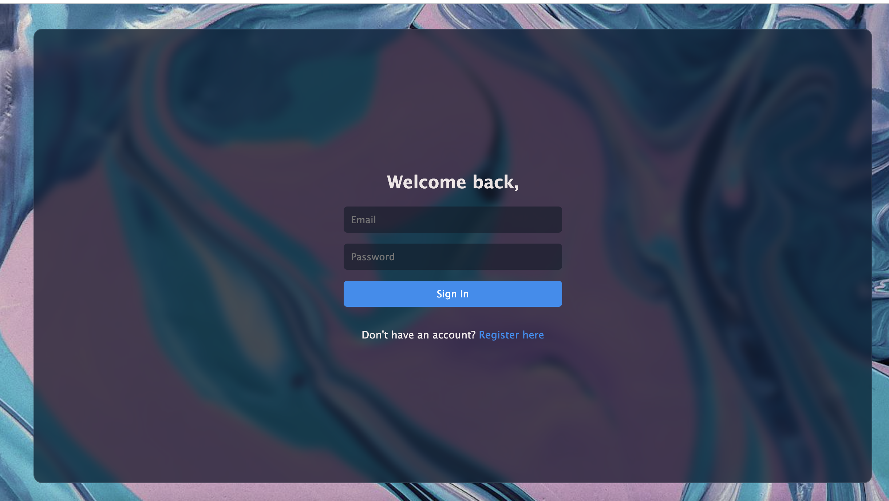
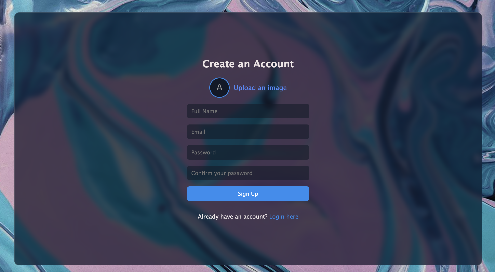

# Gutargu
A real-time chat application built with .NET and React, designed for seamless communication.

## Overview
Gutargu is a simple real-time chat application. This project serves as a sample implementation showcasing basic messaging functionality like real-time messaging, user presence status, and message persistence. It's intended for learning and experimentation, offering a fun way to explore real-time communication in web apps.

## Screenshots

Here are some screenshots of the app in action:

- **Main Area:**  
  

- **Blocked User:**  
  

- **Login Screen:**  
  

- **Signup Screen:**  
  
## Prerequisites

Ensure you have the following installed on your system:

- [.NET 9 SDK](https://dotnet.microsoft.com/en-us/download/dotnet/9.0)
- [Node.js](https://nodejs.org/en/)
- [npm](https://www.npmjs.com/get-npm) or [yarn](https://yarnpkg.com/getting-started) (for frontend dependencies)

## Getting Started

To get started with the Gutargu application, follow these steps:

### 1. Clone the Repository

```bash
git clone https://github.com/yourusername/gutargu.git
cd gutargu
```

### 2. Set Up the Backend (.NET)

   1. Navigate to the backend directory:

      ```bash
      cd gutargu-backend
      ```

   2. Restore the .NET dependencies:

      ```bash
      dotnet restore
      ```
   3. Setup DB connection:
      
      Update the connection string in the `appsettings.development.json` file with your PostgreSQL database credentials.

      ```json
      {
         "ConnectionStrings": {
            "GutarguDB": "Host=localhost;Port=5432;Database=<your_db_name>;Username=<your_pgadmin_username>;Password=<your_pgadmin_password>"
         }
      }
      ```

   4. Apply the database migrations:

      Run following command from the root directory of your backend project -
      ```bash
      dotnet ef database update
      ```

   5. Create **uplods/images** directory in the gutargu-backend folder. This is required to serve static files(images) for now. We will find a fix for this later.

   6. Run the .NET backend:
      ```bash
      dotnet run
      ```

      This will start the backend server, which will be accessible on http://localhost:5000.

### 3. Set Up the Frontend (React)
   1. Navigate to the frontend directory:
      ```bash
      cd ../gutargu-frontend
      ```

   2. Install frontend dependencies:
      ```bash
      npm install
      ```

   3. Setup the env variables:
      
      Add the following line to set the backend API URL (VITE_API_BASE_URL):
      ```bash
      VITE_API_BASE_URL=http://localhost:5158/api
      ```

   4. Run the React development server:
      ```bash
      npm run dev
      ```

      The frontend application should now be running on http://localhost:3000.

### 4. Accessing the Application
##### Backend: The API will be available at http://localhost:5158. This serves the real-time messaging features and handles user connections.
##### Frontend: The user interface will be available at http://localhost:5173. You can send and receive messages in real-time from this interface.

## File Structure

```bash
Gutargu/
├── gutargu-backend/                   # Backend code (API)
│   ├── API/                           # Public API Layer containing controllers
│   ├── Common/                        # Common Enums, Constatns, Exceptions
│   ├── DAL/                           # Data Access Layer Code
│   ├── Services/                      # Business logic (e.g., user auth, manage chats)
│   ├── Properties/                    # Project properties (e.g., debugging, build settings)
│   ├── appsettings.json               # Configuration settings
│   ├── appsettings.Development.json   # Development-specific settings
│   ├── Program.cs                     # Application entry point
│   ├── gutargu-backend.csproj         # Backend project file
│
├── gutargu-frontend/                  # Frontend code (React)
│   ├── public/                        # Static assets (images, fonts, etc.)
│   ├── src/                           # React components and views
│   │   ├── components/                # Reusable components
│   │   └── services/                  # FE services (e.g., API service)
│   ├── package.json                   # Frontend dependencies
│   ├── tsconfig.json                  # TypeScript configuration
│   ├── tsconfig.app.json              # Application-specific TypeScript config
│   ├── tsconfig.node.json             # Node.js-specific TypeScript config
│   └── vite.config.ts                 # Vite config for frontend build
│
├── README.md                          # Project documentation
├── Screenshots                        # Project screenshots
```

## Contributing
1. Fork the repository.
2. Create a new branch:
   ```bash
   git checkout -b feature/your-feature
   ```
3. Make your changes.
4. Commit your changes 
   ```bash
   git commit -a 'Add new feature'
   ```
5. Push to the branch 
   ```bash
   git push origin feature/your-feature
   ```
6. Create a new Pull Request.

## License
This project is open-source and licensed under the [GPL-3.0 license](https://www.gnu.org/licenses/gpl-3.0.en.html).
